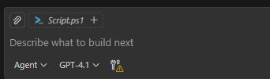

# Lab 2 – PowerShell Automation with Copilot

## 🏛️Scenario

An operations team needs a reusable PowerShell toolkit that audits disk usage, logs findings, and surfaces actionable alerts. Building on Lab 1, you will apply Copilot fundamentals to produce production-ready scripts that downstream labs (Python, YAML, and Ansible) will consume.

## Learning Goals

- Prompt Copilot to scaffold and refactor scripts.
- Implement defensive error handling and structured logging.
- Package scripts into reusable modules and translate outputs for downstream tooling.

## Prerequisites

- PowerShell 7+.
- VS Code with PowerShell & Copilot extensions.
- Test machine or container with mock drives.

## Exercise 1 –  Inline Completions & Ghost Text (20 min)

- Create a new file named `DiskAudit.ps1` inside the `Lab1_PowerShell` folder.

**Inline Copilot** (start typing a comment and let Copilot suggest the change).

1. Copy the following Comment and paste in the script file:
```
#Generate a PowerShell script that lists disks, free space %, and flags volumes below 15% free.
```
2. Pause typing and observe Copilot's ghost text suggestion; accept with Tab if appropriate
3. From the toolbar select Run - Run without debugging  or (F5) to  Run the script
4. Use GitHub Copilot to add parameters for remote computer targets:

**Copilot Chat**

Open Copilot Chat (Ctrl+Shift+I) and ask:
```
How do I add a ComputerName parameter to my PowerShell script and use it for remote execution?
```
- The goal is to learn how Copilot can help you refactor your script to accept remote computer names as input, and use PowerShell remoting to audit disks on those computers.

## Exercise 2 – Structured Logging & Error Handling

Use Edit mode - Open Copilot chat Ctrl+shift+i
Make sure in are in Edit mode and stand on the script file `DiskAudit.ps1`

1. Ask Copilot to "Add ComputerName parameter to the PowerShell script and use it for remote execution"
2. Ask Copilot to wrap the script in `Try/Catch` blocks.


## Exercise 3 – Ask mode

1. Open script file script.ps1
Do you know what this script does?
2. Change copilot mode to ask mode -make sure your context is the script file


```
Explain in plain English what this PowerShell script does?
```
3. Run the script and check if you see files in the SystemReport folder.

## Exercise 3 – Agent mode

1. Change to  Agent mode - and ask copilot 
```
Add detailed comments to this script.
```
```
Refactor and optimize this script.
```
2. Review the changes and keep them.
3. Make sure the script is running.
4. Ask Copilot to help you persist results as JSON
```
persist all results from csv files to one JSON file
```
4. Run the script and check if you see a json files with all the details in the SystemReport folder.

🔥Lab 1 is complete! Proceed to Lab 2 – Python Automation with Copilot.
