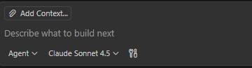

# Lab 3 – YAML & Config Generation

## Scenario

You will use GitHub Copilot to transform structured data from your PowerShell and Python scripts into YAML configurations for automation workflows and configuration files.

**The purpose of this lab is to learn how GitHub Copilot can help you:**

- Convert between different data formats (JSON ⇄ YAML)
- Generate configuration files for automation tools
- Create reusable templates for infrastructure as code

## Learning Goals

- Use Copilot to convert formats (JSON to YAML and vice versa)
- Generate GitHub Actions workflow configurations
- Create configuration templates for automation pipelines

## Prerequisites

- Completed Lab 2 (PowerShell) and Lab 3 (Python)
- JSON output files from previous labs
- `yaml` VS Code extension (install from VS Code Extensions marketplace) - <https://marketplace.visualstudio.com/items?itemName=redhat.vscode-yaml>

## Exercise 1 – JSON to YAML Translation


1. Copy the JSON file from Lab 1 (PowerShell) or Lab 2 (Python) in VS Code to the `Lab3_YAML` folder.
2. Select all the JSON content (Ctrl+A)
3. Open Copilot Chat (Ctrl+Shift+I) use Ask mode
4. Ask: `"Convert this selected JSON to YAML format"`
5. Create a new file named `system_config.yaml` inside the `Lab3_YAML` folder
6. Copy the YAML output from Copilot Chat
7. Paste the YAML content into the system_config.yaml file
8. stand on the yaml that was created
Ask Copilot: "Add comments to explain each section of this YAML file"

Exit and close the yaml file

## Exercise 2 – Configuration Templates

**Use Copilot to generate configuration files:**

1. Open Copilot chat and click on Add context

2. Click on Files and folders and choose the lab3_YAML folder.
3. In agent mode - Ask Copilot Chat:

   ```text
   "Create a new file named `app_config.yaml` inside the `Lab3_YAML` folder with a configuration template for a system monitoring application with sections for:
   - Thresholds (disk space, memory, CPU)
   - Logging settings
   - Alert recipients
   - Schedule settings"
   ```

4. Review and customize the generated configuration.
5. Ask Copilot to add validation comments or schemas to the YAML.


## Exercise 3 – Ansible Inventory Files (Prep for Lab 4)

**Use Copilot to create Ansible inventory files:**

In this exercise, you'll create Ansible inventory files in YAML format. These will be used in Lab 4 for automation.

1. Create a new file named `inventory.yaml` inside the `Lab3_YAML` folder.
2. Ask Copilot Chat in **Agent mode**:

   ```text
   "Create an Ansible inventory file in YAML format with:
   - Three host groups: development, staging, production
   - Each group has 2-3 server entries with ansible_host IPs
   - Include variables like ansible_user and ansible_port
   - Add comments explaining each section"
   ```

3. Review the generated inventory file.
4. Create a `group_vars` folder inside `Lab3_YAML`.
5. Ask Copilot to create environment-specific configuration files:

   ```text
   "Create three YAML files in the group_vars folder:
   - development.yaml with dev environment settings
   - staging.yaml with staging environment settings  
   - production.yaml with production environment settings
   Each should include:
   - Environment name
   - Monitoring thresholds from app_config.yaml
   - Log levels (debug for dev, info for staging, error for prod)
   - Deployment settings"
   ```

6. Ask Copilot: "Explain how Ansible uses inventory files and group_vars"
7. Verify all YAML files are valid using the YAML extension.

**These files will be used in Lab 4 for Ansible automation!**

## Exercise 4 – Document Your Best Prompts

**Create a prompt guide for future reference:**

Now that you've completed multiple exercises, document the most effective prompts you discovered.

1. Create a new file named `PROMPT_GUIDE.md` inside the `Lab3_YAML` folder.
2. Ask Copilot Chat in **Agent mode**:

   ```text
   "Create a markdown file that documents the best prompts for YAML generation tasks. Include sections for:
   - Converting between formats (JSON/YAML)
   - Generating configuration files
   - Creating Ansible inventory files
   - Adding comments and documentation
   - Validation and troubleshooting
   
   For each section, provide 2-3 example prompts with explanations of why they work well."
   ```

3. Review the generated guide and customize it with your own successful prompts from this lab.
4. Add a section called "Lessons Learned" and document:
   - Which prompts worked best for you
   - What context helped Copilot give better answers
   - Any patterns you noticed in effective prompts
5. Ask Copilot: "Add tips for writing effective prompts when working with YAML and configuration files"

**This file will serve as your reference guide for future YAML and configuration tasks!**

## Copilot Prompt Sampler

- "Add YAML anchors and aliases to reduce duplication in this configuration"
- "Explain the difference between single-line and multi-line strings in YAML"
- "Create a YAML schema for validating this configuration file"
- "Convert this PowerShell hashtable to YAML format"

## Validation Checklist

- [ ] YAML files are properly formatted and valid
- [ ] JSON to YAML conversion preserves all data
- [ ] Configuration templates include helpful comments
- [ ] Ansible inventory.yaml and group_vars files are created
- [ ] PROMPT_GUIDE.md documents effective prompts from your experience

## Stretch Goals

- Use Copilot to add YAML anchors and aliases to reduce duplication in inventory files
- Ask Copilot to generate host_vars files for specific server configurations
- Use Copilot to create a YAML validation script in Python
- Generate additional Ansible variables files for different deployment scenarios

Lab 3 is complete! The YAML files you created (especially inventory.yaml and group_vars) will be used in Lab 4 – Ansible Automation with Copilot.
