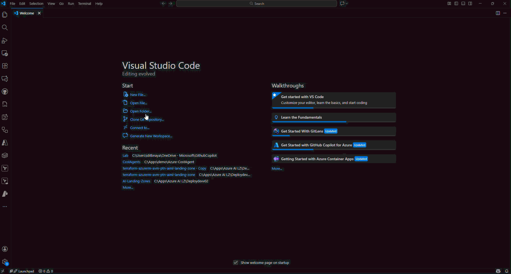
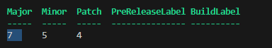

# GitHub Copilot Lab – Participant Quickstart

Use this checklist when you join the **GitHub Copilot Lab for IT & DevOps**. It assumes no prior experience with GitHub, Visual Studio Code, or Copilot.

## 1. Prerequisites


## 2. Install Required Software

1. Install the latest Visual Studio Code from [code.visualstudio.com](https://code.visualstudio.com/Download).
1. Install Git:

    - Windows: download from [git-scm.com](https://git-scm.com/download/win) and accept default settings (ensure "Git from the command line" is enabled).
    - macOS: install Xcode Command Line Tools (`xcode-select --install`) or download from git-scm.
    - Linux: use your package manager (`sudo apt install git`, `sudo dnf install git`, etc.).
1. Install PowerShell 7 if you will run PowerShell labs locally:

    - **Windows (recommended)**: open an elevated PowerShell window and run `winget install --id Microsoft.PowerShell --source winget`. Restart your shell so the new `pwsh` command is available.
    - **Windows (download alternative)**: download the `.msi` installer from https://github.com/PowerShell/PowerShell/releases/download/v7.5.4/PowerShell-7.5.4-win-x64.msi
    - **macOS**: install via Homebrew with `brew install --cask powershell`, then start it with `pwsh`.
    - **Linux**: follow the distribution-specific instructions on the [official installation guide](https://learn.microsoft.com/powershell/scripting/install/installing-powershell) (for example, `sudo apt-get install -y powershell` on Ubuntu after adding the Microsoft repository).

1. Install Python 3.10 or later from [python.org](https://www.python.org/downloads/) and ensure `python`/`pip` are on your `PATH`.

## 3. Clone the Training Repository

Choose one of the following:

  1. Open the VS Code welcome screen.
  2. Select **Clone Git Repository**.
  3. Paste `https://github.com/Iditbnaya/GitHub-Copilot-Lab-IT-DevOps.git` and pick a local folder.
 

  ```bash
  git clone https://github.com/Iditbnaya/GitHub-Copilot-Lab-IT-DevOps.git
  cd GitHub-Copilot-Lab-IT-DevOps
  ```

  1. Click **File → Clone repository**.
  2. Search for `GitHub-Copilot-Lab-IT-DevOps` under the `Iditbnaya` account.
  3. Choose a local path and click **Clone**.

## 4. Open the Workspace

1. Launch VS Code and choose **File → Open Folder…**.
2. Select the cloned `GitHub-Copilot-Lab-IT-DevOps` directory.
3. When prompted about making the folder trusted, select **Yes, I trust the authors**.

## 5. Enable GitHub Copilot

1. In VS Code, open the Extensions view (`Ctrl+Shift+X`).
2. Install **GitHub Copilot** and **GitHub Copilot Chat**.
3. Sign into GitHub when prompted; approve any device-code or SSO requests.
4. Use the Command Palette (`Ctrl+Shift+P`) → `GitHub Copilot: Toggle Copilot` to verify the extension responds.
5. Open Copilot Chat (`Ctrl+I`) and ask "What can you do?" to confirm chat access.

## 6. Prepare Local Runtimes

Open the VS Code terminal (`Ctrl+~) and verify the following:

$psversionTable.PSVersion

- If PowerShell 7 is installed correctly, you should see output similar to:


- If the **Major** version is 5, you are using Windows PowerShell, not PowerShell 7. If you have already installed PowerShell 7 but `pwsh` is not recognized, follow these steps:
  1. Find where PowerShell 7 is installed (commonly `C:\Program Files\PowerShell\7`).
  2. Add that folder to your system `PATH` environment variable:
  - Open **System Properties** > **Advanced** > **Environment Variables**.
  - Under **System variables**, select `Path` and click **Edit**.
  - Click **New** and add the path to your PowerShell 7 folder (e.g., `C:\Program Files\PowerShell\7`).
  - Click **OK** to save and close all dialogs.
  3. Restart your terminal or VS Code.
  4. Try running `$psversionTable.PSVersion` again.
- For more help, see the [official installation guide](https://learn.microsoft.com/powershell/scripting/install/installing-powershell).
- **ansible-core**: Automation framework for configuration management. Install via pip: `pip install ansible-core`. See the [official installation guide](https://docs.ansible.com/ansible/latest/installation_guide/intro_installation.html) for more options.
- **Docker Desktop**: Containerization platform for running containers locally. Download from [docker.com/products/docker-desktop](https://www.docker.com/products/docker-desktop/) and follow the setup wizard for Windows, macOS, or Linux.

## 7. Follow the Lab Sequence

1. Read `ReadMe.md` in the repo root for the lab roadmap and environment notes.
2. Complete labs in order:
   - `Lab1_GettingStarted` – Copilot fundamentals.
   - `Lab1_PowerShell` – PowerShell automation with Copilot.
   - `Lab2_Python` – Python ingestion and enrichment.
   - `Lab2_YAML` – YAML and config generation.
   - `Lab3_Ansible` – Ansible playbook automation.
   - `Lab4_GitHub_Actions` – CI/CD pipeline.
   - `Lab5_Agents` – Copilot Agents governance.
3. After each exercise, capture notes in the suggested `notes/` files or your preferred location.

## 8. Syncing Changes (Optional)

If you plan to share your work:

1. Create a new branch: `git checkout -b <your-name>/lab-notes`.
2. Stage changes: `git add .`.
3. Commit: `git commit -m "Add lab1 notes"`.
4. Push: `git push -u origin <your-name>/lab-notes`.
5. Open a pull request on GitHub for review or archival.

## 9. Troubleshooting Tips

## Common Issues

- **GitHub Copilot not responding**: Ensure you are signed in to GitHub and have an active Copilot subscription. Restart VS Code if necessary.
- **PowerShell 7 not recognized**: Verify installation and ensure the installation path is added to your system `PATH`.
- **Python or Ansible not found**: Confirm installations and that their executables are on your system `PATH`.

## 10. Ready for the Workshop

Once the setup checklist is complete, you are ready to join the lab sessions. Keep this guide handy for future workshops or to help colleagues get started.
